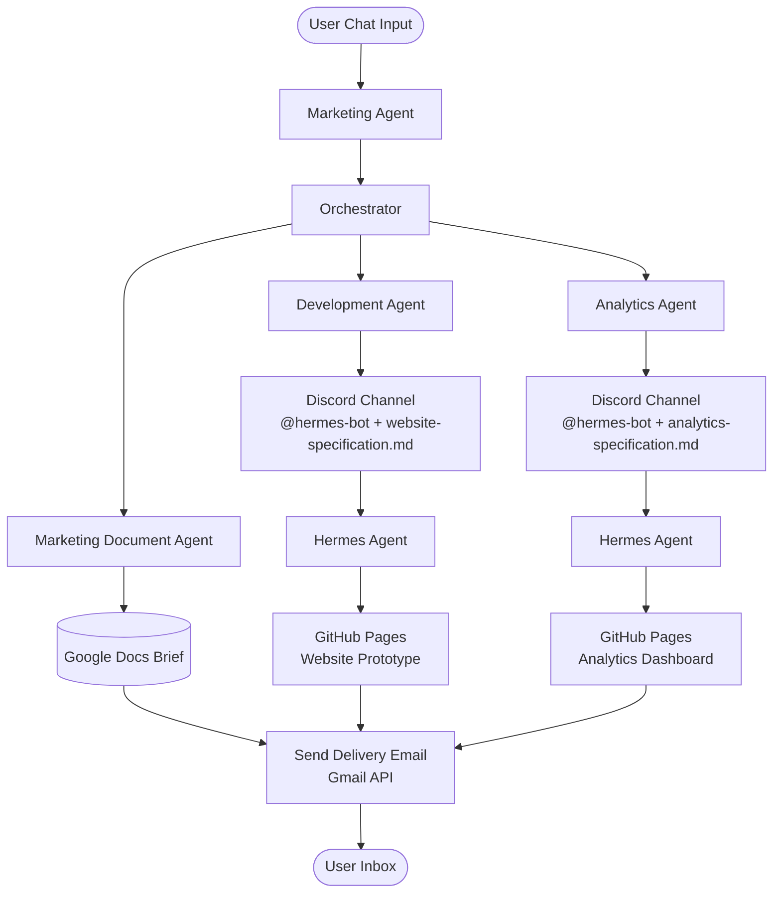

# Synergy Marketing Ecosystem — Setup Guide

Welcome to the documentation suite for setting up the **Synergy Marketing Ecosystem** workspace. This system connects n8n workflows, Hermes Agent, Ollama, Discord, Google Workspace Services (Gmail, Drive, Docs), and GitHub / GitHub Pages into an integrated AI agent ecosystem.

This guide provides step-by-step instructions for laboratory exercises and hands-on setup, enabling you to create your own accounts, generate API credentials, set up permissions, create custom repositories, and configure local and cloud environments safely.

---

## Table of Contents

### Core Integration & Credentials Guides

| Document | Description | Key Focus Areas |
| :--- | :--- | :--- |
| [Ollama Setup Guide](ref/ollama.md) | Installing and configuring Ollama on local devices & cloud | Desktop installation (macOS/Windows/Linux), model library (`ollama.com/library`), host binding (`OLLAMA_HOST`), Docker DNS (`host.docker.internal`), Base URLs table, `ollamaApi` credentials, Ollama Cloud setup. |
| [OpenRouter Setup & Model Routing Guide](ref/openrouter.md) | Account creation, API keys, model selection, auto-routing & fallback chains | Account sign-up, generating API keys (`sk-or-v1-...`), free models (`:free`), paid commercial models, `openrouter/auto` routing, fallback chains, n8n & Hermes integration. |
| [Google Account & Cloud Console Setup](ref/google-account.md) | Setting up Google API access for n8n workflows | OAuth 2.0 Client ID/Secret, OAuth consent screen, Gmail/Drive/Docs API enablement, callback URLs, Google Drive folder setup, n8n `gmailOAuth2`, `googleDocsOAuth2Api`, and `googleDriveOAuth2Api` credentials. |
| [Discord Developer & Dual-Bot Setup](ref/discord.md) | Creating Discord applications, bot tokens, and permissions | Creating `n8n-bot` (`N8N_BOT_TOKEN`) and `hermes-bot` (`HERMES_BOT_TOKEN`), Message Content Intent, server invite links, Discord Channel ID extraction, Bot-to-Bot `@mention` protocol. |
| [GitHub PAT & GitHub Pages Guide](ref/github.md) | Personal Access Tokens (Classic) and free repository hosting | Creating PATs (Classic) with `repo` scopes, security practices, creating custom repositories, enabling GitHub Pages on `/docs` folder, live URL mapping. |
| [Hermes Agent Installation & Integration](ref/hermes.md) | Installing Hermes Agent and linking LLMs, Discord & GitHub CLI | Hermes installation script, LLM provider config (Ollama/OpenRouter), Discord gateway linking, automated specification processing, `gh` CLI auth, git identity config. |

### Infrastructure & Self-Hosting Options

| Document | Description | Key Focus Areas |
| :--- | :--- | :--- |
| [n8n Self-Hosting & Deployment Guide](ref/n8n.md) | Hosting an independent n8n instance natively or with Docker | Native npm/npx launch (`n8n start`), Docker & Docker Compose setup, environment variables (`WEBHOOK_URL`, `N8N_HOST`), database pruning, host-to-container network binding (`host.docker.internal`). |
| [Oracle VirtualBox & Linux Mint Setup Guide](ref/oracle-vm.md) | Creating an isolated VirtualBox VM running Linux Mint for Hermes Agent | Downloading VirtualBox & Linux Mint ISO, VM creation, hardware allocation, installing Guest Additions (desktop extensions), bidirectional clipboard, preparing Hermes execution environment. |
| [UTM Virtualization Setup Guide for macOS](ref/utm.md) | Setting up UTM for hosting Linux Mint / Ubuntu guest VMs on macOS | Open-source UTM virtualization, Apple Silicon (ARM64) & Intel support, VM creation, SPICE Guest Agent installation, shared directory configuration, Hermes deployment. |

### Ecosystem Tool Classification, License Types & Purpose Matrix

| Tool Name | Tool Overview & Classification | License Type | Purpose in Synergy Ecosystem | Reference Guide |
| :--- | :--- | :--- | :--- | :--- |
| **Discord** | Instant messaging, Voice-over-IP (VoIP), and digital collaboration platform. | Proprietary / Freemium | Central communication and event gateway hosting `n8n-bot` (notifications) and `hermes-bot` (interactive AI agent). | [Discord Setup](ref/discord.md) |
| **GitHub & GitHub Pages** | Web-based developer platform for Git version control and static web publishing. | Proprietary Cloud Platform / Freemium (CLI is MIT) | Source code repository host, PAT authentication manager, and live web host (`/docs`) via GitHub Pages. | [GitHub Setup](ref/github.md) |
| **Google Workspace & Cloud Console** | Cloud computing platform and productivity software suite (Gmail, Drive, Docs). | Commercial / Proprietary (Free-tier quota limits) | OAuth 2.0 API provider enabling n8n to generate Google Docs, manage Google Drive folders, and send summary emails via Gmail. | [Google Setup](ref/google-account.md) |
| **Hermes Agent** | Open-source autonomous AI agent and command execution engine by Nous Research. | Open Source (MIT License) | Autonomous developer and execution engine running scripts, managing repositories via `gh` CLI, and handling Discord prompts. | [Hermes Setup](ref/hermes.md) |
| **n8n** | Node-based workflow automation platform and integration orchestrator. | Sustainable Use License (Fair-code / free for internal use) | Central workflow orchestration engine connecting triggers, AI model nodes, Google APIs, and Hermes Agent tasks. | [n8n Setup](ref/n8n.md) |
| **Ollama & Ollama Cloud** | Open-source LLM inference framework, local model server, and cloud model API service. | Open Source (MIT License for server; Commercial Cloud API) | Local or cloud-hosted open-source LLM provider supplying AI reasoning to n8n nodes and Hermes Agent. | [Ollama Setup](ref/ollama.md) |
| **OpenRouter** | Unified API gateway and aggregator for multi-provider AI language models. | Commercial / Pay-as-you-go API Gateway (Free-tier models) | Cloud LLM fallback provider offering access to state-of-the-art open-source and commercial models. | [OpenRouter Setup](ref/openrouter.md) |
| **Oracle VirtualBox & Linux Mint** | Open-source virtualization hypervisor paired with a Linux Mint desktop OS. | Open Source / Free Software (GNU GPLv3) | Secure, isolated local virtual machine sandbox on Windows and Linux PCs for hosting Hermes Agent. | [Oracle VM Setup](ref/oracle-vm.md) |
| **UTM Virtual Machines** | macOS-native virtual machine host built on Apple Hypervisor.framework and QEMU. | Open Source (Apache License 2.0) | Hardware-accelerated ARM64/x86 VM sandbox environment on macOS for hosting Hermes Agent. | [UTM Setup](ref/utm.md) |

---

## Synergy Marketing Ecosystem — Workflow Architecture & Laboratory Overview

The ecosystem operates through 5 interconnected n8n workflows:

1. **Marketing Agent**:
   - Accepts user chat prompts and uses Ollama to generate a complete JSON marketing plan containing campaign overview, image prompts, content strategy, website layout, and analytics requirements.
2. **Orchestrator**:
   - Evaluates the marketing plan using Ollama and dispatches tasks to downstream sub-workflows in parallel. Upon completion, composes and sends a delivery summary email via Gmail API (`gmailOAuth2`).
3. **Marketing Document Agent**:
   - Formats the plan into a structured document, creates it inside a custom Google Drive folder using Google Docs API (`googleDocsOAuth2Api`), and shares it publicly using Google Drive API (`googleDriveOAuth2Api`).
4. **Development Agent**:
   - Generates a full website technical specification (`website-specification.md`). `n8n-bot` sends a Discord message mentioning `hermes-bot` with the specification file attached, instructing Hermes to update the website repository's `/docs` directory.
5. **Analytics Agent**:
   - Generates simulated analytics projection data and a technical specification (`analytics-specification.md`). `n8n-bot` sends a Discord message mentioning `hermes-bot`, instructing Hermes to update the analytics repository's `/docs` directory.

### Workflow Architecture Map (Visual Format)



#### Workflow Architecture Map (Text Format)
```text
[User Chat Input]
       │
       ▼
[Marketing Agent]
       │
       ▼
[Orchestrator]
       │
       ├─────────────────────────────────┼─────────────────────────────────┐
       ▼                                 ▼                                 ▼
[Marketing Document Agent]     [Development Agent]             [Analytics Agent]
       │                                 │                                 │
       ▼ (Google Docs/Drive API)         ▼ (n8n-bot to Discord)            ▼ (n8n-bot to Discord)
[Google Docs Brief]            [Discord Channel]               [Discord Channel]
                                         │ (@hermes-bot mention)           │ (@hermes-bot mention)
                                         ▼                                 ▼
                               [Hermes Agent]                  [Hermes Agent]
                                         │ (Git commit to /docs)           │ (Git commit to /docs)
                                         ▼                                 ▼
                               [GitHub Pages Website]          [GitHub Pages Analytics]
       │                                 │                                 │
       └─────────────────────────────────┴─────────────────────────────────┘
                                         │
                                         ▼
                            [Send Delivery Email (Gmail API)]
                                         │
                                         ▼
                                   [User Inbox]
```

---

## Laboratory Setup Checklist

Complete the following checklist to ensure all accounts, credentials, and parameters are properly configured for your laboratory setup:

### 1. Ollama & OpenRouter Setup
- [ ] Install Ollama locally (macOS/Windows/Linux) or set up Ollama Cloud account ([ref/ollama.md](ref/ollama.md)).
- [ ] Pull/configure target models (using `gemma4:31b-cloud` as the LLM model of choice, or local models via `ollama run gemma4:31b`).
- [ ] Configure `OLLAMA_HOST="0.0.0.0:11434"` for local network listening.
- [ ] Create `ollamaApi` credential in n8n (`Ollama account`) pointing to your host URL (e.g., `http://host.docker.internal:11434`).
- [ ] Create an OpenRouter account ([ref/openrouter.md](ref/openrouter.md)) and generate an API Key (`OPENROUTER_API_KEY`) for cloud LLM fallback/auto-routing.

### 2. Google Cloud Console & Workspace Setup
- [ ] Create a Google Cloud Project in Google Cloud Console.
- [ ] Enable Gmail API, Google Drive API, and Google Docs API.
- [ ] Configure OAuth Consent Screen (add your Google email to Test Users).
- [ ] Create OAuth 2.0 Client ID and Client Secret (Web Application type).
- [ ] Add n8n Authorized Redirect URI (`https://synergylabs.app.n8n.cloud/rest/oauth2-credential/callback` or self-hosted URI).
- [ ] Create `gmailOAuth2` credential in n8n (`Gmail account`).
- [ ] Create `googleDocsOAuth2Api` credential in n8n (`Google Docs account`).
- [ ] Create `googleDriveOAuth2Api` credential in n8n (`Google Drive account`).
- [ ] Create a custom `Marketing Campaign Briefs` folder in Google Drive and copy the **Folder ID** into the Marketing Document Agent workflow.

### 3. Discord Developer & Dual-Bot Setup
- [ ] Create Discord Application 1: `n8n-bot` and obtain `N8N_BOT_TOKEN`.
- [ ] Create Discord Application 2: `hermes-bot` and obtain `HERMES_BOT_TOKEN`.
- [ ] Enable **Message Content Intent** on both bot applications in Discord Developer Portal.
- [ ] Generate OAuth2 invite links (`bot` scope) and invite both bots to your Discord server.
- [ ] Enable Developer Mode in Discord settings and copy your **Discord User ID**.
- [ ] Copy your target Discord **Channel ID** and **Server ID (Guild ID)**.
- [ ] Create `discordBotApi` credential in n8n (`Discord Bot account`) using `N8N_BOT_TOKEN`.
- [ ] Update Development Agent and Analytics Agent workflows with your Server ID, Channel ID, and `@hermes-bot` User ID mention tag.

### 4. GitHub & GitHub Pages Setup
- [ ] Create a Personal Access Token (PAT Classic) with `repo` scopes.
- [ ] Create custom public repository 1 for website prototype (e.g., `website-prototype`).
- [ ] Create custom public repository 2 for analytics prototype (e.g., `analytics-prototype`).
- [ ] Enable GitHub Pages on both repositories (Source: Deploy from branch `main`, Folder `/docs`).
- [ ] Update clone repository URLs in Development Agent and Analytics Agent Discord node prompts with your HTTPS repository URLs.

### 5. Hermes Agent Setup
- [ ] Install Hermes Agent on your target host environment or VPS ([ref/hermes.md](ref/hermes.md)).
- [ ] Run `hermes setup` to configure LLM provider (Ollama or OpenRouter).
- [ ] Run `hermes gateway setup`, select Discord, and input `HERMES_BOT_TOKEN` and your Discord User ID.
- [ ] Install GitHub CLI (`gh`) on the Hermes host environment.
- [ ] Authenticate GitHub CLI (`gh auth login`) using your GitHub PAT Classic.
- [ ] Set global Git user identity (`git config --global user.name` & `user.email`).
- [ ] Start Hermes gateway (`hermes gateway start`) and verify connectivity with `hermes doctor`.

### 6. Infrastructure & Self-Hosting Options (Optional)
- [ ] Self-host n8n instance natively (`n8n start`) or via Docker Compose ([ref/n8n.md](ref/n8n.md)).
- [ ] Create an isolated VirtualBox Linux Mint VM for Hermes Agent ([ref/oracle-vm.md](ref/oracle-vm.md)) with Guest Additions.
- [ ] Set up a UTM Linux guest VM on macOS ([ref/utm.md](ref/utm.md)) with SPICE Guest Agent.

---

## Recommended Setup Sequence

To complete your lab setup without dependency blockers, follow this order of setup:

1. **Step 1: [Ollama Setup](ref/ollama.md) & [OpenRouter Setup](ref/openrouter.md)**
   - Set up your local Ollama backend or OpenRouter cloud API keys so n8n agent nodes and Hermes have an inference engine ready.
2. **Step 2: [Google Account & Cloud Credentials](ref/google-account.md)**
   - Configure Google Cloud APIs, create OAuth 2.0 credentials for Mail, Drive, and Docs, and create your campaign Google Drive folder.
3. **Step 3: [Discord Developer & Dual-Bot Setup](ref/discord.md)**
   - Create your `n8n-bot` and `hermes-bot` applications, obtain bot tokens, extract your Discord Channel ID, and invite both bots to your server.
4. **Step 4: [GitHub & GitHub Pages Setup](ref/github.md)**
   - Create your GitHub PAT (Classic) and set up your personal GitHub repositories with GitHub Pages enabled on the `/docs` folder.
5. **Step 5: [Hermes Agent Setup](ref/hermes.md)**
   - Install Hermes Agent, configure its LLM provider (Ollama or OpenRouter), link it to your Discord `hermes-bot`, and connect GitHub CLI (`gh`).

---

## Essential Security & Safety Rules

> **Warning: API Keys & Secrets Protection**
> - Never commit raw API keys, OAuth Client Secrets, Discord Bot Tokens, or GitHub Personal Access Tokens to public git repositories.
> - Store credentials in environment variables (`.env` files listed in `.gitignore`) or n8n's secure credential store.

> **Caution: OAuth Consent Screen Testing Mode**
> - When creating Google Cloud credentials in "Testing" mode, OAuth refresh tokens expire after 7 days. Ensure your test user email is explicitly added to the consent screen configuration.

> **Note: Custom Laboratory Configuration**
> - During the setup steps, you will create your own unique Google Drive folders, Discord channel IDs, and GitHub repositories. Be sure to update these custom values inside your n8n workflow nodes.
